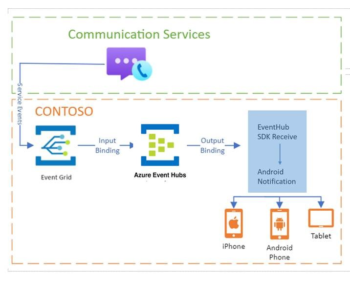
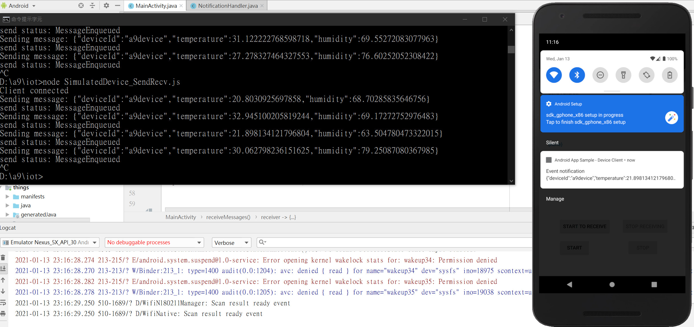

# Android Sample for receive IoT Hub Event as push notification
## Add EventHub SDK for payload receiver and trigger Android push notification
### 1.Please modify your own IoT Hub built-in event hub endpoint in the MainActivity.java
### 2.Check the comment in code to know how to get those values : 
#### // az iot hub show --query properties.eventHubEndpoints.events.endpoint --name {your IoT Hub name}
#### // az iot hub show --query properties.eventHubEndpoints.events.path --name {your IoT Hub name}
#### // az iot hub policy show --name service --query primaryKey --hub-name {your IoT Hub name}

